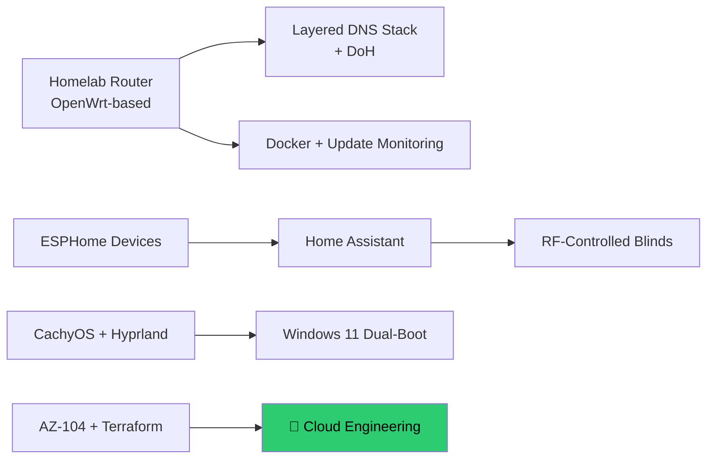

# Hi 👋, I'm Anıl

### IT Systems Specialist → Cloud Engineering | Infra tinkerer | Self-hosting enthusiast

- 🔭 I work in IT systems & infrastructure support, and I'm working towards a **Cloud Engineering** career path
- 🌱 Currently deepening my skills in **Azure, on-prem & cloud virtualization, PowerShell & Terraform**
- 🎓 Certified: **AZ-104** (Azure Administrator), studying for **Terraform Associate (003)**
- 🏠 I run a homelab — layered DNS architecture, containerised services, and home automation. Documented with the reasoning behind each decision: **[myhomelab](https://github.com/anilgunduzz/myhomelab)**
- 🖥️ Daily driver: **CachyOS (Arch-based)** with **Hyprland**, dual-booting Windows 11
- 🏡 Currently working on **RF-controlled roller blind automation** with **ESPHome**
- 🖨️ Outside of tech: 3D printing, miniature/figure painting, and PC gaming
- 💬 Ask me about: Azure, homelab networking, home automation, or Terraform

---

### 🧩 What I'm building right now

---

### 📫 How to reach me

- LinkedIn: [linkedin.com/in/anil-gunduz](https://www.linkedin.com/in/anil-gunduz/)
