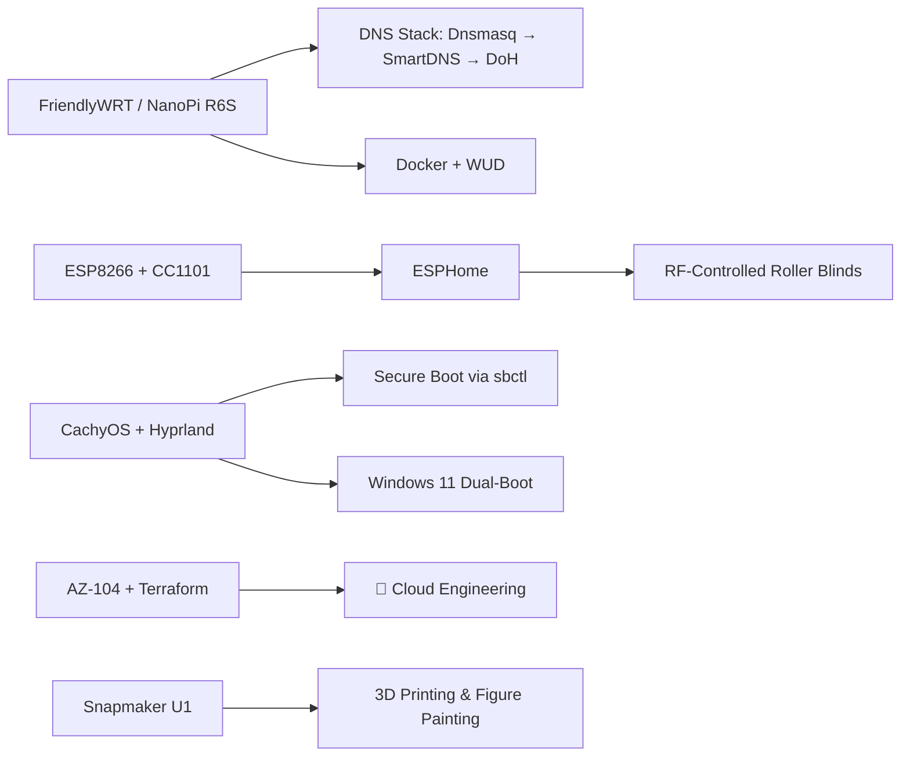

<h1 align="center">Hi 👋, I'm Anıl</h1>
<h3 align="center">IT Systems Specialist → Cloud Engineering | Infra tinkerer | Self-hosting enthusiast</h3>

- 🔭 I work in IT systems & infrastructure support, and I'm working towards a **Cloud Engineering** career path
- 🌱 I'm currently deepening my skills in **Azure, on-prem & cloud virtualization, PowerShell & Terraform**
- 🎓 Certified: **AZ-104** (Azure Administrator), studying for **Terraform Associate (004)**
- 🏠 I run a homelab: **FriendlyWRT / NanoPi R6S**, layered DNS stack (Dnsmasq → SmartDNS → DoH), Docker + [WUD](https://github.com/getwud/wud) for update monitoring
- 🖥️ Daily driver: **CachyOS (Arch-based)** with **Hyprland**, dual-booting Windows 11 (Secure Boot via `sbctl`)
- 🏡 Currently automating **RF-controlled roller blinds** with a CC1101 + ESP8266 setup in **ESPHome**
- 🖨️ Outside of tech: 3D printing with my **Snapmaker U1**, getting into **miniature/figure painting**, and PC gaming
- 💬 Ask me about: Azure, homelab networking, home automation, or Terraform

---

### 🧩 What I'm building right now

---

### 📫 How to reach me

- LinkedIn: [linkedin.com/in/anil-gunduz](https://www.linkedin.com/in/anil-gunduz/)
- Email: anilgunduz@outlook.com

<!--
Tip: GitHub also supports profile view counters, stats cards (github-readme-stats),
and streak stats if you want extra visual flair, e.g.:

-->
